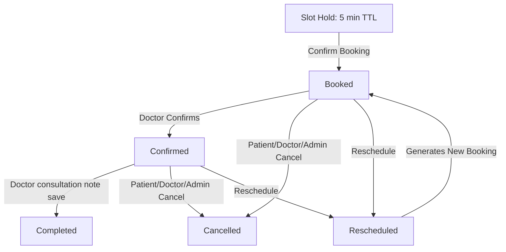

# MediBridge - Healthcare Appointment & Follow-up Manager

MediBridge is an AI-powered, full-stack healthcare platform designed to connect patients, doctors, and administrators through a centralized appointment scheduling, Google Calendar synchronization, and automated prescription reminders engine.

---

## 1. Project Overview & Features

### Patient Portal
- **Authentication**: Register and log in.
- **Search & Selection**: Find doctors by specialization, view real-time availability slots.
- **Appointment Booking**: Securely hold a slot for 5 minutes and book by providing symptoms.
- **Consultation View**: Read post-visit clinical notes, prescriptions, and an AI-generated patient-friendly summary.
- **Rescheduling & Cancellation**: Cancel or reschedule appointments directly from the details page.
- **Medication Reminders**: Receive automated medication alerts in the background.

### Doctor Portal
- **Dashboard**: View upcoming bookings and historical consultation logs.
- **AI Pre-Visit Assessment**: Read a quick symptom summary, urgency rating, and suggested diagnostic questions before the patient arrives.
- **Post-Visit Notes**: Record clinical notes, observations, diagnosis, follow-up instructions, and prescriptions.
- **AI Post-Visit Summary**: Auto-generate a compassionate patient summary and medication schedule.
- **Google Calendar Connection**: Authenticate using OAuth 2.0 to sync appointments.

### Admin Portal
- **Doctor Profiles**: Create, manage, activate/deactivate, or delete doctors.
- **Specialization & Parameters**: Set doctor specializations, slot durations, and working hours.
- **Leave Management**: Schedule leave dates for doctors (which automatically cancels conflicts and alerts patients).

---

## 2. Platform Workflows & Lifecycles

### Appointment Status Lifecycle


---

## 3. Database Schema Overview

- **User**: Authentication accounts (Patients, Doctors, Admins) containing name, email, phone, role, and active status.
- **DoctorProfile**: Links to a User; contains specialization, qualification, fee, experience, slot duration, weekly working hours, and Google Calendar tokens.
- **DoctorLeave**: Stores leaves per doctor date with unique composite constraints.
- **Appointment**: Captures date, slot timings, status, symptoms, rescheduled links, and Google Calendar event identifiers.
- **PreVisitAssessment**: Holds patient symptoms, complaint summary, urgency, and suggested diagnostic questions.
- **Consultation**: Records clinical notes, diagnosis, prescriptions (medicine, dosage, frequency, duration, instructions), and AI summaries.
- **MedicationReminder**: Schedules upcoming reminder alerts per prescription item.
- **EmailQueue**: Holds failed emails for background retry attempts.

---

## 4. API Documentation

### Authentication Routes (`/api/auth`)
- `POST /register` | Public | Register new patient account
- `POST /login` | Public | Log in and receive JWT cookie/token
- `GET /me` | Required | Get current authenticated user details

### Doctor Routes (`/api/doctors`)
- `GET /` | Public | List active doctors
- `GET /:id` | Public | Retrieve detailed profile of a doctor
- `POST /` | Admin | Register new doctor profile
- `PATCH /:id` | Admin | Update doctor credentials/specialization
- `PATCH /:id/status` | Admin | Activate/deactivate a doctor
- `DELETE /:id` | Admin | Remove doctor profile
- `GET /:doctorId/availability` | Public | View slots for a date
- `POST /:doctorId/leave` | Admin | Configure doctor leave day
- `GET /:doctorId/leave` | Admin/Doctor | View doctor leave days

### Appointment Routes (`/api/appointments`)
- `POST /hold` | Patient | Obtain 5-min slot hold
- `POST /` | Patient | Confirm appointment booking
- `GET /` | Authenticated | List appointments (filtered by ownership)
- `GET /:id` | Authenticated | Retrieve details of an appointment
- `PATCH /:id/status` | Doctor | Update status (Confirm/Complete)
- `PATCH /:id/cancel` | Authenticated | Cancel appointment
- `PATCH /:id/reschedule` | Authenticated | Reschedule appointment

### Consultation Routes (`/api/consultations`)
- `POST /` | Doctor | Submit post-visit notes and complete appointment
- `GET /appointment/:appointmentId` | Authenticated | Fetch consultation record

### Pre-Visit Assessment Routes (`/api/pre-visit`)
- `GET /:appointmentId` | Authenticated | Fetch symptoms assessment

---

## 5. System Design Write-Up

### I. Double-Booking Prevention
MediBridge prevents duplicate bookings through database-level constraints combined with ACID transaction sessions. A Mongoose partial filter unique index is configured on the `Appointment` collection:
```javascript
appointmentSchema.index(
    { doctor: 1, date: 1, startTime: 1 },
    { unique: true, partialFilterExpression: { status: { $in: ["booked", "confirmed"] } } }
);
```
Only active appointments participate in this index. On booking confirmation or rescheduling, a session is initialized (`mongoose.startSession()`) and executed inside a transaction block (`startTransaction()`). The application re-queries conflicting active appointments before creating the record. Any concurrent booking attempts trigger a MongoDB unique index exception (error code `11000`), forcing the transaction to abort and safely rejecting the second booker.

### II. Doctor Leave Handling
When an administrator logs a leave day, it is recorded in the `DoctorLeave` collection. A post-save process immediately queries all active bookings for that doctor on that date. The system loops through these records, changes their status to `cancelled`, appends the cancellation reason, and issues immediate email notifications. To handle this efficiently, notifications are dispatched using `notifyAppointmentCancelled`. If email delivery fails, it is backed up to `EmailQueue` to keep the administrative API response instantaneous. Future bookings on this leave date are blocked during availability slot generation (`availabilityService.js`) by verifying if `DoctorLeave` records exist.

### III. Slot Hold Mechanism
To secure slots during input forms, the platform employs a concurrency hold mechanism. The `AppointmentHold` model stores temporary holds with a unique index on `{ doctor, date, startTime }` and a Time-To-Live index:
```javascript
appointmentHoldSchema.index({ expiresAt: 1 }, { expireAfterSeconds: 0 });
```
Because MongoDB TTL deletion runs on background cycles (up to every 60 seconds), the service explicitly deletes expired holds before checking availability or creating new holds. This ensures that expired slots are immediately freed. Booking validates ownership of the hold, inserts the appointment within a transaction, and deletes the hold record atomically.

### IV. Notification Failure Handling
To shield critical workflows (booking, cancellation, rescheduling) from network or SMTP service downtime, all email notifications use a background retry queue. The `sendEmail` service wraps SMTP dispatch inside a try-catch block. If mail delivery throws an exception, the system writes the recipient, subject, and payload to the `EmailQueue` collection with status `failed`. A lightweight background task runner runs every 30 seconds on the server, scanning the queue for failed entries. It retries transmission using a progressive retry delay (`retryCount * 2 minutes`) up to a maximum of 3 times.

---

## 6. Setup & Configuration

### Environment Variables (`server/.env`)
Create a `.env` file under the `/server` directory with the following variables:
```text
PORT=5000
MONGO_URI=your_mongodb_connection_string
JWT_SECRET=your_jwt_secret
CLIENT_URL=http://localhost:5173
NODE_ENV=development

GEMINI_API_KEY=your_gemini_api_key
GEMINI_MODEL=gemini-2.5-flash

SMTP_HOST=smtp.gmail.com
SMTP_PORT=587
SMTP_USER=your_email@gmail.com
SMTP_PASSWORD=your_app_password
SMTP_SECURE=false
EMAIL_FROM=MediBridge <your_email@gmail.com>

GOOGLE_CLIENT_ID=your_client_id
GOOGLE_CLIENT_SECRET=your_client_secret
GOOGLE_REDIRECT_URI=http://localhost:5000/api/calendar/callback
APP_TIMEZONE=Asia/Kolkata
```

### Installation & Run

1. **Database**: Run MongoDB locally or use MongoDB Atlas.
2. **Start Backend**:
   ```bash
   cd server
   npm install
   npm run dev
   ```
3. **Start Frontend**:
   ```bash
   cd client
   npm install
   npm run dev
   ```
4. **Build Production**:
   ```bash
   cd client
   npm run build
   ```

### Google Calendar Setup
1. Visit the Google Cloud Console and create a project.
2. Enable the Google Calendar API.
3. Configure the OAuth Consent Screen and add scope `.../auth/calendar.events`.
4. Create Credentials -> OAuth Client ID (type: Web Application).
5. Add Authorized Redirect URI matching `GOOGLE_REDIRECT_URI` in `.env`.

---

## 7. Known Limitations
- Background processing runs in-process using Node.js intervals; in distributed production, a dedicated task runner like BullMQ should be used.
- Google Calendar token refresh operations occur synchronously on client initialization.